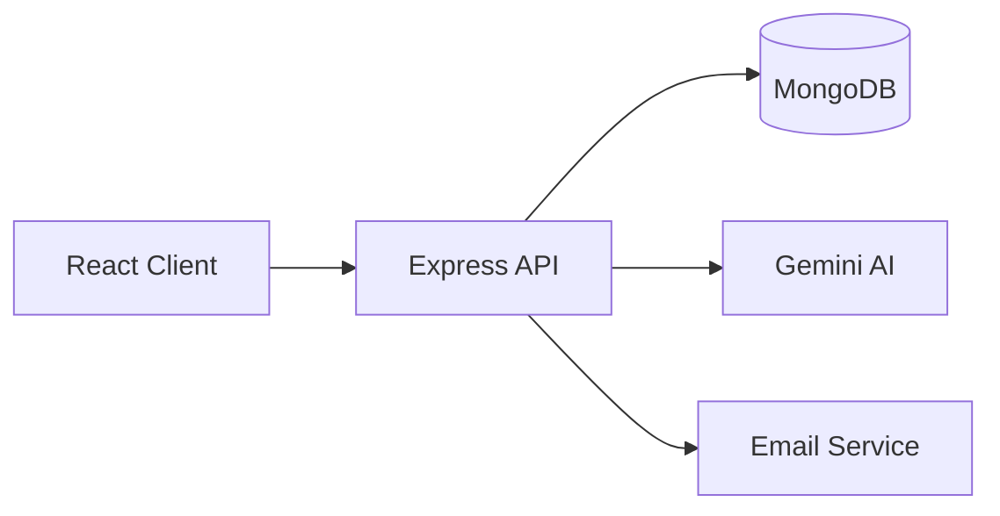

# 🎓 Education Platform

A full-stack MERN Learning Management System (LMS) that enables students, instructors, and administrators to manage online education through courses, assignments, examinations, certificates, analytics, and AI-assisted learning tools.

## ✨ Features
- JWT Authentication & Role-Based Access
- Student, Instructor and Admin dashboards
- Course & Lesson Management
- Assignment creation, submission and grading
- Online Exams & Results
- Certificate Generation
- Progress Tracking
- AI-powered assistance (Gemini integration)
- Email Notifications
- Docker support

## 🛠 Tech Stack

| Layer | Technology |
|---|---|
| Frontend | React, Vite, Redux Toolkit |
| Backend | Node.js, Express |
| Database | MongoDB |
| Auth | JWT |
| AI | Google Gemini |
| Deployment | Docker |

## 📂 Project Structure

```text
- edu/
  - education-platform-main/
    - docker-compose.yml
    - docker-compose.prod.yml
    - .gitignore
    - package.json
    - server/
      - .dockerignore
      - package-lock.json
      - package.json
      - Dockerfile.prod
      - server.js
      - Dockerfile
      - .env.example
    - client/
      - .dockerignore
      - package-lock.json
      - nginx.conf
      - tailwind.config.js
      - index.html
      - package.json
      - Dockerfile.prod
      - Dockerfile
```

## 🚀 Getting Started

```bash
git clone <repo>
cd education-platform
```

### Backend

```bash
cd server
npm install
npm run dev
```

### Frontend

```bash
cd client
npm install
npm run dev
```

## Environment Variables

Server `.env`

```env
PORT=
MONGODB_URI=
JWT_SECRET=
GEMINI_API_KEY=
EMAIL_USER=
EMAIL_PASS=
```

## Docker

```bash
docker compose up --build
```

## Architecture



## Modules
- Authentication
- User Management
- Courses
- Lessons
- Assignments
- Exams
- Certificates
- Analytics
- AI Assistant

## Contributing
Fork the repository, create a feature branch, commit changes and open a pull request.


## Author
Soham Bhattacharya, Samit Nandi
